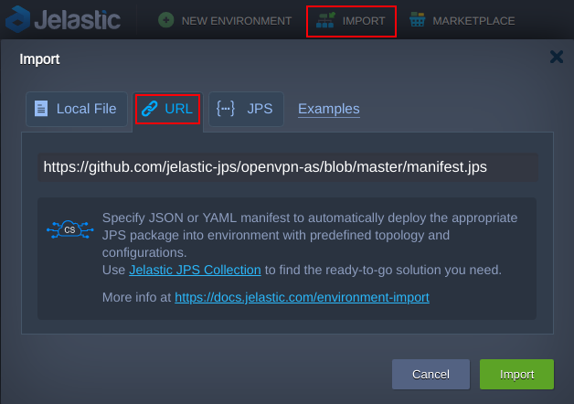
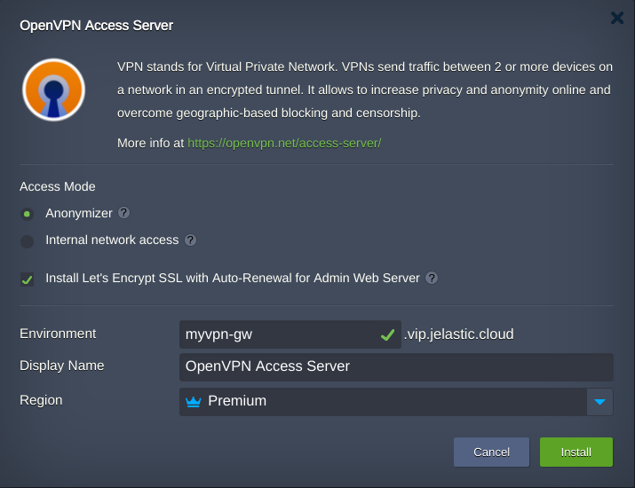
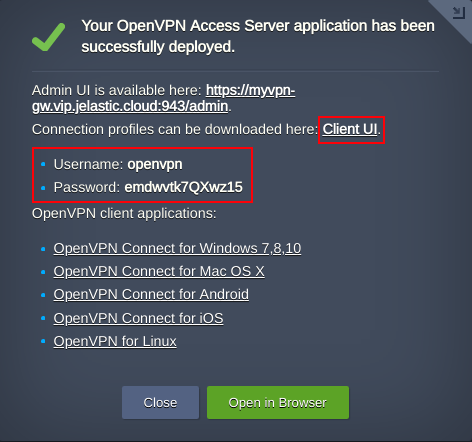
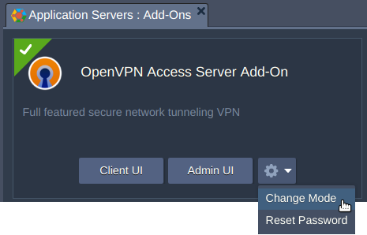

# OpenVPN Access Server with Let’s Encrypt CA

 

OpenVPN Access Server is a set of tools that simplify the rapid deployment of a remote access VPN server. It is based on the popular OpenVPN open source software, allowing you to work with a configured VPN server using cross-platform client software. The built-in web administration panel provides an ability to setup all possible OpenVPN configurations. It can be complemented with a free Let’s Encrypt SSL certificate with automatic renewal.

## OpenVPN Access Server Installation

Sign in your Jelastic account and import the [manifest.jps](https://github.com/jelastic-jps/openvpn-as/blob/master/manifest.jps) by pressing **Import** button. 

 

Choose an installation mode:   

  - **Anonymizer** allows to hide user's identity when browsing the Internet
  - **Internal network access** provides an access to the private network within in the Cloud:
      - private cloud network is limited with the same [isolated environment group](https://docs.jelastic.com/environment-isolation/) or with the same [region](https://docs.jelastic.com/environment-regions/) where OpenVPN Access Server is installed
    - clients will use OpenVPN node as a DNS server
  -  Pick [Let's Encrypt Add-On](https://jelastic.com/blog/free-ssl-certificates-with-lets-encrypt/) installation to secure OpenVPN Access Server web admin insterface with help of valid SSL certificate.
  

 

The expected topology looks as follows:

 

## OpenVPN Management

Using credentials and **Client UI** link you can access a panel from which the OpenVPN profiles can be downloaded. 

 

In case you have no OpenVPN client software installed, choose an appropriate one for your OS.
This solution comes with a free OpenVPN Access Server license for **two** concurrent connections. Use **Admin UI** link and the same credentials to apply for extra connections license or change other settings.

### Admin Panel Custom Domain

To generate Let’s Encrypt SSL certificate for a [custom domain](https://docs.jelastic.com/custom-domain-via-arecord), open **Add-Ons** tab, find [Let’s Encrypt SSL Add-On](https://jelastic.com/blog/free-ssl-certificates-with-lets-encrypt/), press **Configure** and specify the custom domain name which should be bound to a public IP of your node at your domain registrar.  

### Access Server Mode

If necessary you can change the mode of VPN solution via **OpenVPN Access Server Add-On**.

 

## Deploy Now
Press **DEPLOY TO JELASTIC** to deploy OpenVPN solution to a certified Jelastic partner from the distributed network of independent data center service providers. 

 
