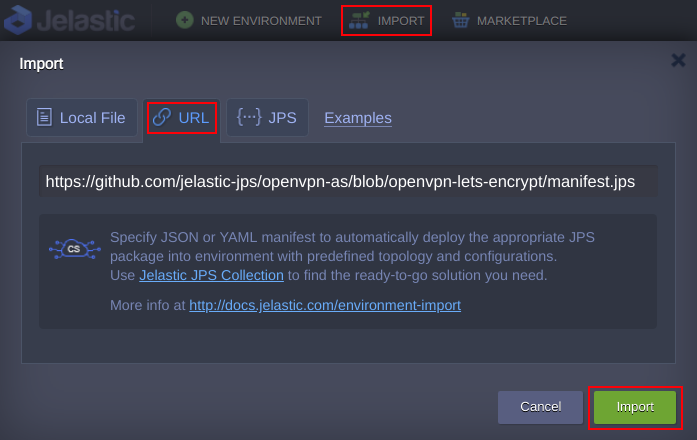
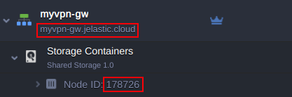
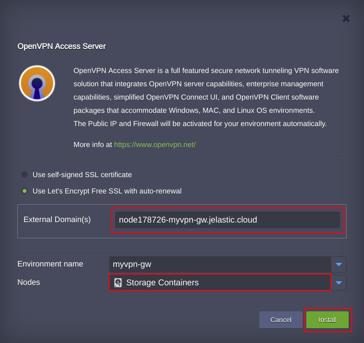
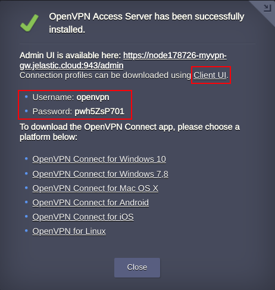

# OpenVPN Access Server with Let’s Encrypt CA

 

OpenVPN Access Server (OpenVPN-AS) is a set of tools that simplify the rapid deployment of a remote access VPN server. It is based on the popular OpenVPN open source software, allowing you to work with a configured VPN server using cross-platform client software. The built-in web administration panel provides an ability to set of all possible OpenVPN configurations. It’s complemented with free, automated, and open certificate authority (CA) the Let’s Encrypt with automatic renewal.

## OpenVPN-AS Installation

Sign in your Jelastic account and import the manifest.jps pressing Import button. 

 

To generate Let’s Encrypt certificate, specify the domain name according to [hostname guide](https://docs.jelastic.com/container-dns-hostnames#common-hostnames) or either a [custom domain](https://docs.jelastic.com/custom-domain-via-arecord) which is bound to the public IP of your node. Choose the Environment Name and Nodes the Add-On will be installed on. 

 

 

Using credentials and Client UI link you can access a user panel from which the OpenVPN profiles can be downloaded. 

 

In case you have no OpenVPN client software installed, choose an appropriate one for your OS.
This solution comes with a free OpenVPN-AS license for two concurrent connections. Use admin panel to apply for extra connections license.

### Deploy Now
Press Deploy to get an account and deploy to a certified Jelastic partner from the distributed network of independent data center service providers. 

 

### OpenVPN-AS Managed Hosting Business

To start offering this solution to your customers please follow to [Managed PaaS Hosting Business](https://jelastic.com/apaas/)

